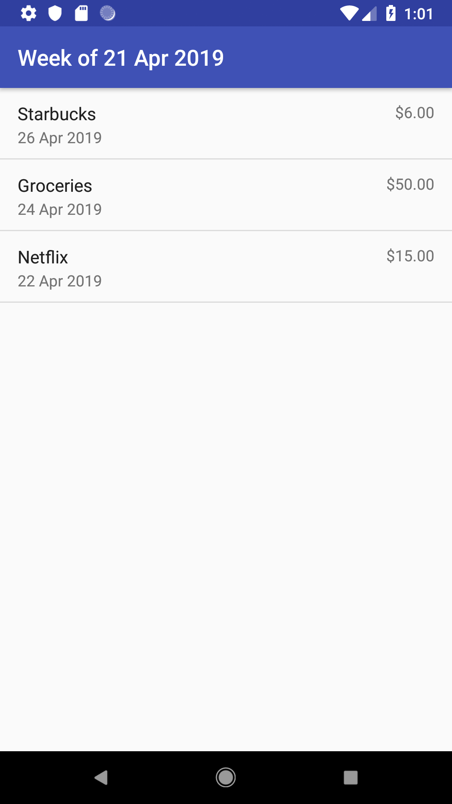

# MarbleRye

Let's get this bread.

Dead simple spending/expense tracker. Enter expenses, and application shows how much has been spent, along with daily, weekly, and monthly spending averages.

Inspiration for the name:
https://www.youtube.com/watch?v=QfuuXwQMDyE

## Screenshots
|||
|------------|-------------|
|  |  |
|  |  |
